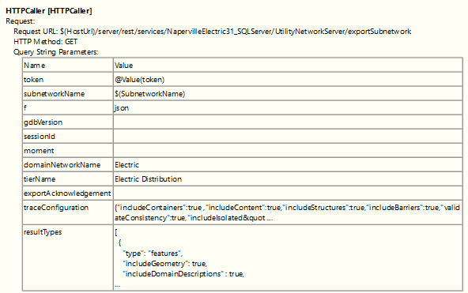

# export-subnetwork-only
 
This solution uses the JSON return of the Export Subnetwork REST api and relies only on its supported parameters. These parameters as configured by the author are very powerful and can also be parameterized, if desired.

## Instructions
1. Fork and then clone the repo. 
> [!NOTE]
> If you do not intend to contribute to this repo, you can just download the workspace tempalte (fmwt file).
2. Unzip to your desired destination and open the FME workspace template (fmwt) file using Data Interoperability workbench app. 
> [!NOTE]
> The solution is meant as a guide. The provided workspace will not run without configuring your own enterprise utility network dataset correctly. The token getter is configured to work with Basic authentication using the UN owner account username and password. If you use OAUTH2 or other authentication types for your dataset, a web connection must be created and the [ESRIOnlineTokenGetter](https://hub.safe.com/publishers/bruceharold/transformers/esrionlinetokengetter) will need to be replaced by an HTTPCaller using that new web connection. 
3. Re-configure the workspace to your own utility network. 
> [!IMPORTANT]
> If the results of the Export Subnetwork as configured is sufficient for the destination data, there is no further configuration needed.

Optional:
4. Reconfigure the following Query String parameters of the Export Subnetwork HTTPCaller using the GP pane tool as reference.

## Requirements
* Data Interoperability for ArcGIS Pro 3.1 or higher
* ArcGIS Pro 3.1 or  higher
* Enterprise Utility Network with a schema of UNv6 or higher

## Suggestions for reconfiguring the solution
1. Enable both the Feature Cache and Feature Counts tools while authoring. When you are satisfied with the state of your solution, 
2. Test small, test often at the beginning. Start with the reader first.
3. Use the Play buttons on the canvass object as you tweak the existing solution.
4. Avoid Importing feature types on an existing format reader. Use Add reader format to add the first feature type/s. After the schema hydrates connect to the existing transformer from which the original reader is connected to. Once the new feature types is connected to the transformer, you can delete the original reader.
5. Configure the Export Subnetwork rest API http caller to your desired tool parameters. Start with Pro, configure the GP tool, then run. Capture the paramteres using atool like Fiddler or Postman.

## Resources
Below are links to essential references used in the blogs.

Utility Network docs: 
* [Export Subnetworks (Doc)](https://pro.arcgis.com/en/pro-app/latest/help/data/utility-network/export-subnetworks.htm) 
* [Trace (Doc)](https://pro.arcgis.com/en/pro-app/latest/help/data/utility-network/about-tracing-utility-networks.htm) 
* [Utility Network Upgrade History (Doc)](https://pro.arcgis.com/en/pro-app/latest/help/data/utility-network/utility-network-upgrade-history.htm) 
* [Export Subnetwork GP Tool (Doc)](https://pro.arcgis.com/en/pro-app/latest/tool-reference/utility-networks/export-subnetwork.htm) 
* [Export Subnetwork Rest API (Doc)](https://developers.arcgis.com/rest/services-reference/enterprise/exportsubnetwork-utility-network-server-.htm) 
* [Network Topology index (Pro SDK Doc)](https://github.com/esri/arcgis-pro-sdk/wiki/ProConcepts-Utility-Network#network-topology) 
* [Tracing subset of the Utility Network (Pro SDK Doc)](https://github.com/esri/arcgis-pro-sdk/wiki/ProConcepts-Utility-Network#tracing) 

Utility Network blogs (latest on top): 

Name and Link | Pro/Enterprise Version | Date
--- | --- | ---
[Adding Description to Export Subnetwork JSON blog](https://community.esri.com/t5/arcgis-utility-network-questions/adding-descriptions-to-export-subnetwork-json/m-p/367933)| 2.4 |	3/10/2020
[Command line automation for Utility Network blog](https://www.esri.com/arcgis-blog/products/utility-network/administration/automating-utility-network-functions-using-command-line/)| 2.1/10.6	| 6/5/2018
[Web Trace tool Blog](https://www.esri.com/arcgis-blog/products/utility-network/data-management/a-technical-walk-through-for-a-simple-utility-network-web-trace-tool-with-javascript/) | 2.1/10.6 | 2/28/2018

Data Interoperability doc and related Automation blogs 
* [Spatial ETL Tool (Doc)](https://pro.arcgis.com/en/pro-app/latest/help/data/data-interoperability/spatial-etl-tools.htm)
* [Automate yor ETL Processes blog](https://community.esri.com/t5/arcgis-data-interoperability-blog/automate-your-etl-processes-on-a-schedule-two-ways/ba-p/883616) 
* [Ontario511](https://pm.maps.arcgis.com/home/item.html?id=4ec1d2420089451bb173e90ce01e2e0a) 
* [Import Building GeoJSON](https://pm.maps.arcgis.com/home/item.html?id=9da0f8ae5fee45aca11bf77f712884c8) 

JSON tutorial references: 
* [Learn JSON](https://www.youtube.com/watch?v=iiADhChRriM) 

## Issues

Find a bug or want to request a new feature?  Please let us know by submitting an issue.

## Contributing

Esri welcomes contributions from anyone and everyone. Please see our [guidelines for contributing](https://github.com/esri/contributing).

## Licensing
Copyright 2021 Esri

Licensed under the Apache License, Version 2.0 (the "License");
you may not use this file except in compliance with the License.
You may obtain a copy of the License at

   http://www.apache.org/licenses/LICENSE-2.0

Unless required by applicable law or agreed to in writing, software
distributed under the License is distributed on an "AS IS" BASIS,
WITHOUT WARRANTIES OR CONDITIONS OF ANY KIND, either express or implied.
See the License for the specific language governing permissions and
limitations under the License.

A copy of the license is available in the repository's [license.txt](https://github.com/salvaleonrp/di-data-driven-electric-utility-export-subnetwork/blob/main/license.txt) file.

